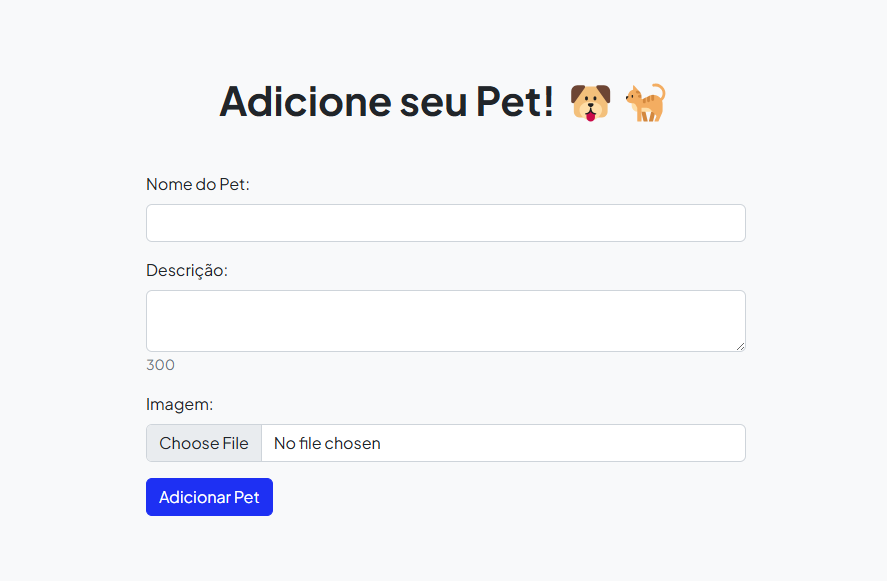

# Trabalho de Web 1

Este projeto é uma página web desenvolvida como parte de um trabalho acadêmico para a disciplina de Web 1. O tema central do site são os "Pets Fofos do TADS", apresentando uma galeria de pets adoráveis.

## 🖼️ Galeria de Screenshots

## 📚 Recursos

- **Bootstrap & Bootstrap Icons**: Utilizados para o design responsivo, componentes estilizados e ícones.
- **Font Awesome**: Ícones adicionais para melhorar a interface do usuário.
- **Google Fonts**: Fontes personalizadas para o site.
- **PHP**: Linguagem de programação utilizada para gerar a galeria de cachorros dinamicamente, conexão com o banco de dados e manipulação de dados dos pets.
- **JavaScript**: Adiciona interatividade à página, permitindo a exibição de informações adicionais sobre os cachorros.
- **SurrealDB**: Banco de dados utilizado para armazenar informações sobre os pets.

## 🏗 Estrutura do Projeto

O projeto é composto pelos principais seguintes arquivos e diretórios:

- [`assets/`](./assets): Diretório para armazenar imagens e outros recursos estáticos como o favicon.
- [`css/`](./css): Contém o arquivo `styles.css` para estilos personalizados do site.
- [`js/`](./js): Contém o arquivo `scripts.js` para adicionar interatividade com JavaScript ao site.
- [`vendor/`](./vendor): Diretório que contém bibliotecas de terceiros, incluindo o autoload do Composer e o SDK do Google Cloud.
- `adicionar.php`, `delete_pet.php`, `edit_pet.php`, `get_total_pets.php`, `save_dog.php`: Scripts PHP para o CRUD dos pets.
- `create_initial_database.php`: Script para criar a estrutura inicial do banco de dados.
- `google_buckets_functions.php`: Contém funções para interagir com o Google Cloud Storage.
- [`index.php`](./index.php): Página principal do site, onde a galeria de cachorros é exibida.
- [`README.md`](./README.md): Este arquivo, contendo informações sobre o projeto.
- [`LICENSE`](./LICENSE): O arquivo de licença do projeto.

## 🚀 Como Executar

Para visualizar o projeto, você precisa ter PHP instalado e configurado na sua máquina e no path do sistema.

1. Clone o repositório ou baixe os arquivos do projeto para o diretório do servidor.
2. Abra o terminal e navegue até o diretório do projeto.
3. Execute o comando `php -S localhost:8000` para iniciar o servidor PHP na porta 8000.
2. Acesse o projeto através do navegador, utilizando o endereço configurado para o seu servidor local (por exemplo, `http://localhost/8000`).

## 🛠 Softwares Utilizados

- **Visual Studio Code**: Editor de código utilizado para desenvolver o projeto, com ajuda da extensão `PHP Server`.
- **SurrealDB**: Banco de dados utilizado para armazenar informações sobre os pets.
- **Fly.io**: Plataforma utilizada para hospedar o banco de dados na nuvem.
- **Google Cloud Storage**: Serviço utilizado para armazenar as imagens dos pets.
- **Docker**: Utilizado para criar o container do projeto para deploy
- **Google Artifact Registry**: Serviço utilizado para armazenar a imagem do container do projeto.
- **Google Cloud Run**: Serviço utilizado para hospedar o container do projeto e disponibilizá-lo na web.

## 🛣Roadmap

- [ ] Criar um formulário para cadastro no site com login e senha
- [ ] Adicionar a funcionalidade de login e logout
- [ ] Adicionar a funcionalidade de comentar e dar like nos pets
- [ ] Adicionar a funcionalidade de editar e excluir comentários
- [ ] Deletar a imagem do Google Cloud Storage quando um pet é excluído
- [ ] Otimizar o código PHP para não exibir todos os pets de uma vez e sim de forma paginada

## 📜Licença

Este projeto é distribuído sob a licença MIT. Veja o arquivo [`LICENSE`](./LICENSE) para mais detalhes.

## 👏Agradecimentos

- **Start Bootstrap**: Por fornecer o template inicial utilizado neste projeto.
- **Professores e colegas**: Por todo o apoio e conhecimento compartilhado.

Desenvolvido com ❤️ pelos alunos do TADS.